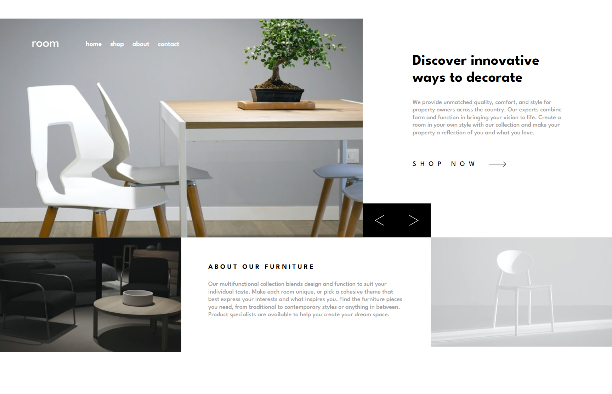

# Frontend Mentor - Room homepage solution

This is a solution to the [Room homepage challenge on Frontend Mentor](https://www.frontendmentor.io/challenges/room-homepage-BtdBY_ENq). Frontend Mentor challenges help you improve your coding skills by building realistic projects. 

## Table of contents

- [Overview](#overview)
  - [The challenge](#the-challenge)
  - [Screenshot](#screenshot)
  - [Links](#links)
- [My process](#my-process)
  - [Built with](#built-with)
  - [What I learned](#what-i-learned)
- [Author](#author)

## Overview

### The challenge

Users should be able to:

- View the optimal layout for the site depending on their device's screen size
- See hover states for all interactive elements on the page
- Navigate the slider using either their mouse/trackpad or keyboard

### Screenshot



### Links

- Solution URL: [https://github.com/kamiliano1/room-homepage](https://github.com/kamiliano1/room-homepage)
- Live Site URL: [https://unrivaled-florentine-39f82f.netlify.app/](https://unrivaled-florentine-39f82f.netlify.app/)

## My process

### Built with

- Semantic HTML5 markup
- CSS custom properties
- Flexbox
- CSS Grid
- Mobile-first workflow
- [React](https://reactjs.org/) - JS library
- [Tailwind CSS](https://tailwindcss.com/) - Tailwind CSS
- [Next.js](https://nextjs.org/) - React framework

### What I learned

This was my first time working with Tailwind CSS, it was great to see Tailwind CSS in the actions. With the text formating and typography, it was really helpful but I had a problem to setup up the sizes of rows and columns in the grid and I used CSS for it
```js
gridTemplateColumns: {
  'midScreen': "1fr 1fr 1fr 1fr",
  'bigScreen': "3fr 3fr max-content 3fr",
},
gridTemplateRows: {
  'midScreen' : 'minmax(300px, 435px) 80px min(30vw, 250px) min(30vw, 250px)',
  'bigScreen' : 'minmax(300px, 435px) 80px min(30vw, 250px)'
},
```

During resizing page from big to small last row of the grid acting weird and I added another media query. It work better that before but still it has white spaces but I could't figured out another way to solve this problem.

## Author

- Website - [Kamil Szymon](https://github.com/kamiliano1)
- Frontend Mentor - [@kamiliano1](https://www.frontendmentor.io/profile/kamiliano1)

